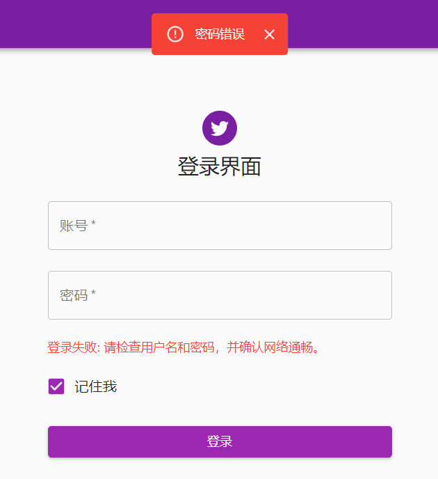
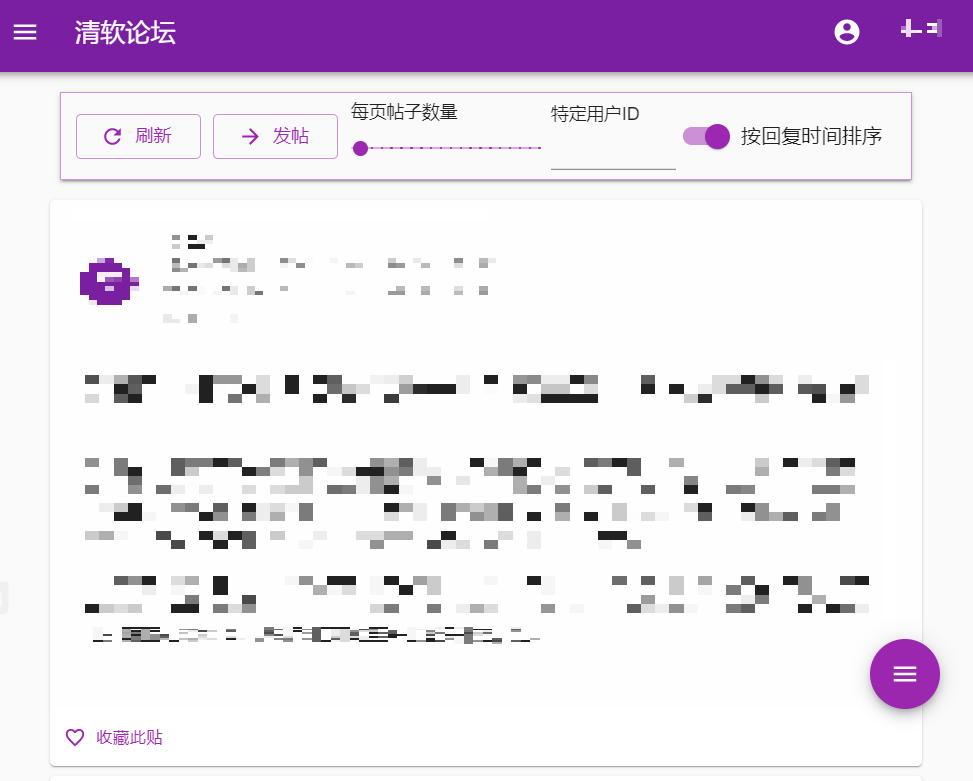
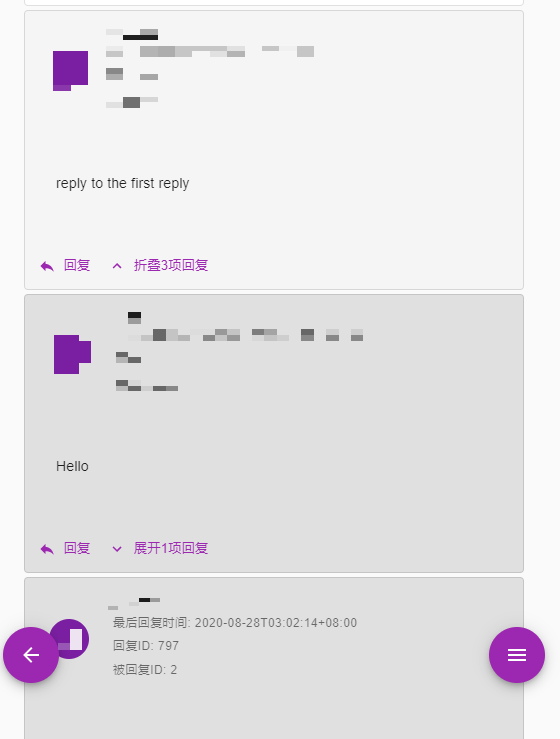
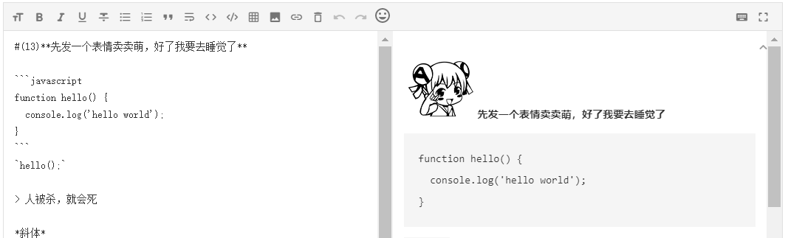
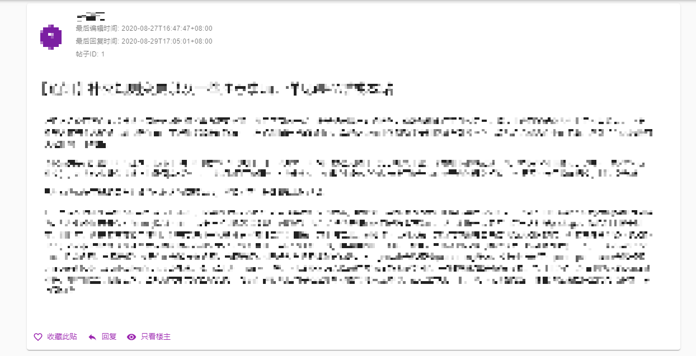
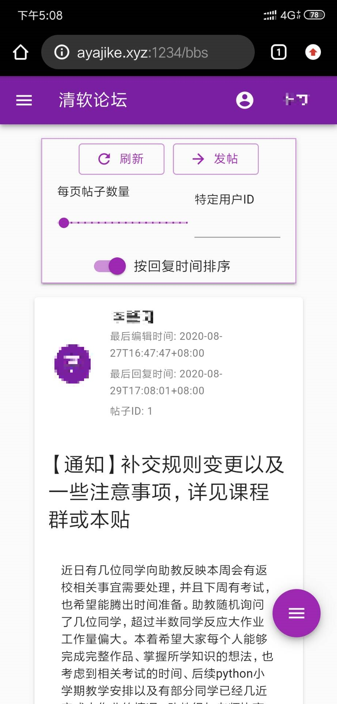

论坛说明
========

论坛是一个允许用户交流沟通的开放平台，百度贴吧、Reddit、NGA游戏社区、虎扑社区都是相对知名度较高的论坛。

在本次综合练习中，我们从零开发出属于清华人专有的论坛------**清软论坛**，并通过助教给予的后端API，与服务器进行交互，并给予用户良好的视觉与操作体验。

开发说明
========

开发环境
--------

-   系统环境: Windows 10

-   开发环境: NodeJS 12.18.3 & React 16.13 & Typescript 3.7

-   主要依赖: React-dom 16.13 & Material-UI 4

-   实际部署环境: Centos 7 & NodeJS 14.8

-   部署网站: <http://ayajike.xyz:1234/>

编译方式
--------

首先运行 `npm install` 安装所有依赖，再运行 `npm run start` 以运行项目。

若要生成项目，可以运行 `npm run build` 命令。

测试用贴
--------

本地运行项目后，本地测试用例网址：<http://localhost:3000/bbs/391>

也可以访问远程测试网址：<http://ayajike.xyz:1234/bbs/391>(随时可能废弃)

基本功能
========

下面一一阐述了本项目所满足的所有功能与需求。

Web脚手架使用
-------------

{#figure:dependency width="40%"}

本次项目使用了相对重量级的 React 框架。同时，受益于 React社区中数量庞大的组件库，本项目的视觉与操作体验在同类产品中别具一格且赏心悦目

React 在快速开发上具有的优势，也为本项目带来了好处，例如 Markdown解析器，以及最重要的 MaterialUI 库的引入，都大大方便了个人的开发

前后端交互及本地存储
--------------------

 

通过使用 axios 网络库，本项目可以与助教所提供的后端进行交互，例如，本项目完成了基本的登录、注销、帖、修改贴子、回复、修改回复等功能。

同时，还设置了当错误出现时的浮动信息栏提示，让用户得以及时了解问题。

不仅如此，项目还含有基于 localStorage 的用户登录状态存储。简而言之，只要用户在拥有 localStorage 功能的浏览器上浏览本页面，就可以保存自己的登录信息，即使退出浏览器也不会退出登录。

同样，在浏览帖子返回后，通过本地的存储，我们可以直接回到上一次浏览帖子之前的位置，而不必从帖子列表的第一页重新查询。

CRUD功能
--------

论坛实现了下述基本功能：

-   **浏览帖子**：在论坛帖子列表索引页面，有帖子查询功能，同时可以浏览帖子的发帖信息及部分内容。当进入帖子内部，就可以显现全部的帖子内容及其回复。

-   **编辑帖子**：在帖子内部，我们可以对帖子或者某一楼层进行回复。如果帖子或者回复属于我们，则可以相应的对其进行修改。

-   **富文本处理**：每个帖子的内容，我们都采用了 Markdown
    格式的富文本解析。在回复界面，也内置了 Markdown 编辑器以及预览窗口。

-   **指定查询**：在论坛帖子列表索引页面，我们可以通过用户 ID
    来查询其所发的所有帖子。

-   **分页处理**：在帖子列表和回复列表中，我们都提供网页底部的换页选择栏。

这些功能都在论坛中得到了很好的体现与实现，并且也有良好 UI 提示，便于用户操作和接受提示反馈。

美观设计
--------

论坛采用了 MaterialUI 图形库，使得界面具有丝滑的体验，而且设计也趋向于移动端样式。

进阶功能
========

楼中楼与分页
------------

分页操作体现在论坛以及帖子回复页面最低端的页面选择栏，允许用户在所有的页面上，进行方便而又简单的跳转切换。

楼中楼页面的设计，受到 Twitter 和 Reddit 的启发，采用了"折叠卡"的形式进行实现。对每一层回复，若有对该楼层的回复，可以通过"展开选项卡"的方式来展开其下所有的回复，并用更深的背景色来标识。

自定义标签、表情与代码段
------------------------

在 Markdown 编辑器中，我们设置了自定义的 `#(:id)` 标签，用于标识自定义表情，并将其内置于我们的 Markdown解析器中，以渲染出对应的 AC 娘表情包图库。

同时，由于 Markdown 中自带有代码段的编辑，因此我们也可以直接利用这个特性，实现我们的代码段输入与展示。

外链及长图展示
--------------

在外链的展示上，由于使用了 Markdown 解析器，且 Markdown 语法中带有超链接元素的渲染，因此该部分的功能在选用 Markdown 编辑器的时候就同时完成了。

在长图展示上，项目内部对 Markdown 解析器进行了适当的魔改，在 AST 渲染成相应的 DOM 元素时，将我们设计好的长图元素代替了原有的 `` 标签元素，实现了长图的灵活展示。

只需要点击长图，长图就会从缩小的状态变为原始大小；再次点击，就会变回缩小的状态(见图

收藏、浏览记录和只看楼主
------------------------

在项目的侧边栏中，可以清晰的看到"收藏"与"浏览记录"选项。当点击相应的按钮后，即会跳转到相应的界面。在收藏夹界面中，我们可以用户在本地收藏的所有网页。在浏览记录中，也可以查看用户之前曾访问过的所有帖子。

在图中可以看到，每个主贴卡片下方，都存在一个"关注"的按钮，点击此按钮即可收藏帖子。同时也有一个"只看楼主"的选项，可以令读者只看到楼主所发的帖子内容。

项目亮点
========

移动端适配
----------

由于使用了 MUI 及 React 框架，本项目搭建的网站可以通过移动端设备直接访问，并且可以获得和电脑端相等的体验。唯一的缺陷在于移动端由于屏幕过窄，在使用 Markdown 编辑器时，若选择边编写边预览模式时，可能会感觉空间不足，需要切换至单编写或单预览模式。

现代化 UI 与人性化操作
----------------------

在采用 MUI 图形库之后，项目整体呈现简洁且仿 Google 的 UI 设计。这一点根据实际的体验和上面的阐述，已经可见一斑。

同时，我们还提供了细微之处的人性化操作。例如，当用户进入帖子后，当返回到论坛主界面时，会重新跳转到之前的页面位置。此外，在编辑自己的回复时，编辑器会将原有的内容作为初始内容，大大方便用户的操作体验。

TypeScript 开发
---------------

在开发过程中，我采用了微软开发的 TypeScript 语言，以弥补弱类型语言 JavaScript 在类型标注上的缺失所带来的不便。

事实证明，在采用了 TS 开发后，尽管在磨合期会觉得复杂且晦涩，但在适应了其强制类型标注的特点后，几乎在编译期间杜绝了因类型错误而出错的情况。

而且 TS 和 React 框架的相互支持十分完善，也给开发带来了很多的优势。譬如当一段时间后自己审查代码，或者当代码交接给他人使用时，可以极大方便地进行二次开发，而不用手忙脚乱的查看注释和查阅文档。